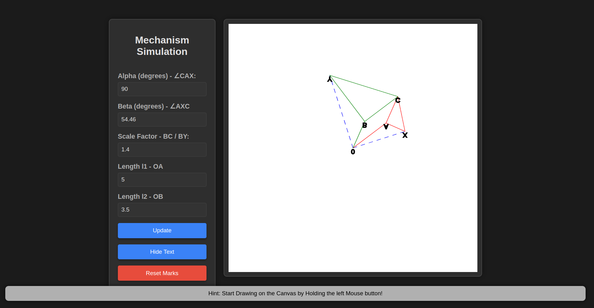
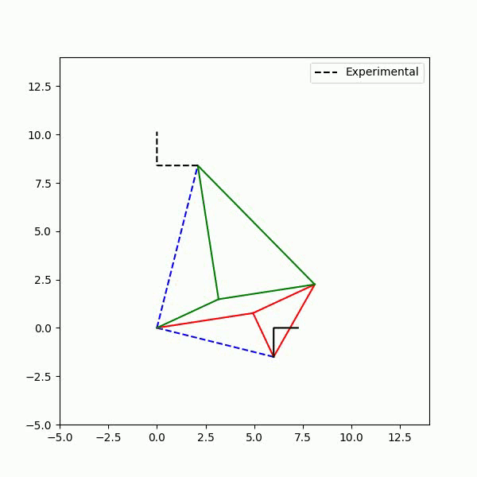

# Simulating a Plagiograph

Click [here](https://plagioplotter.netlify.app/) to Try it Online!

Click [here](https://github.com/RVNayan/Plagiographplotter/blob/main/Reportv3.pdf) to view the Term Paper on the Simulation 

A Plagiograph (pla·gi·o·graph) is mechanism for tracing images and scaling their size. It is inspired from another four-bar mechanism called Pantograph. Thus, it is also known as Skew – Pantograph. It is a simple but quite effective mechanism consisting of two binary and two ternary links with one end being fixed. The free-end is made to move along the target path and the exact image is traced at the other end. The input motion depends on the position (x, y) of the free end in the 2D space, thus it has two degrees of freedom.

The Python code uses basic geometric formulas to map the positions of all the joints. The unique motion of each and every component is captured with precision. You can check out the test run below.

  

  

Please install the following python libaries in you System
1. Pandas
2. Numpy
3. matplotlib
4. OpenCV
5. os

pip install opencv-python-headless (for python)

**Note** installing all of the above packages is necessary for proper functioning of program. 
This code is written in Jupyter Notebook. A .py version will be made available soon.

